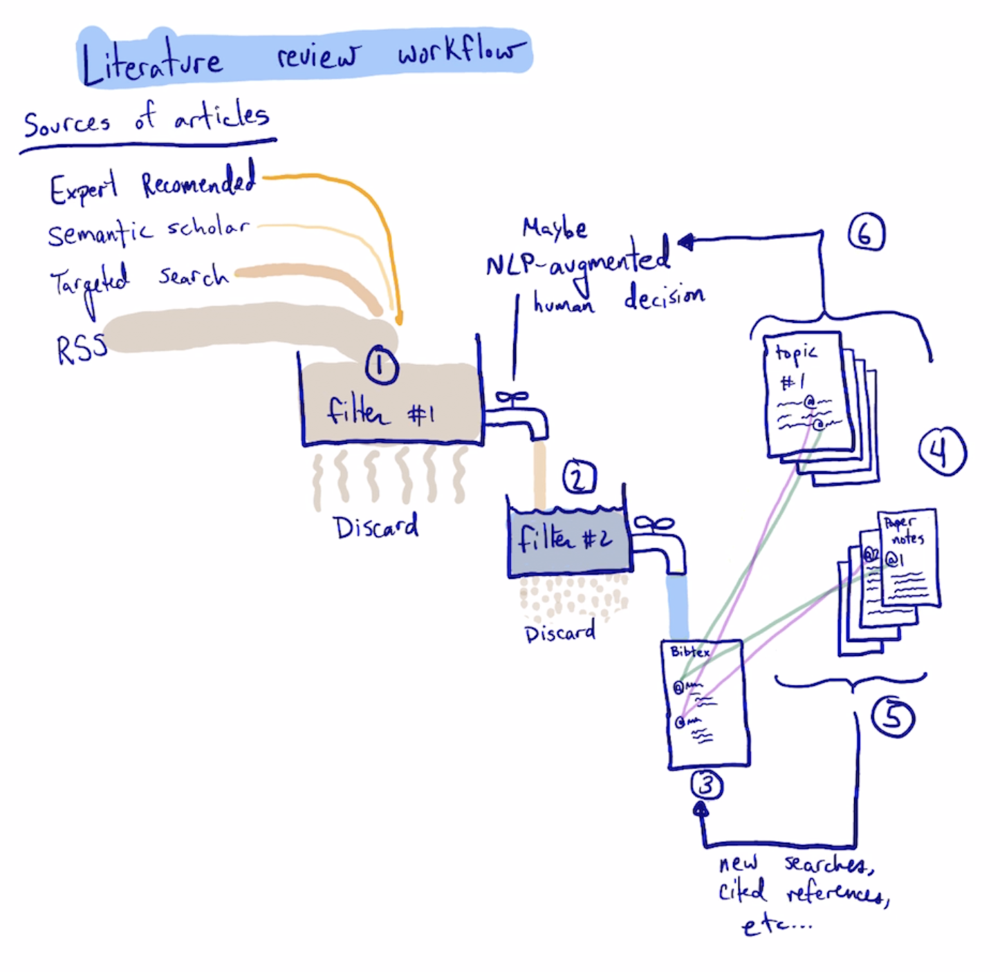

CO2RR Literature Review
----------------------------------------
    
    The idea in this repo is to create a set of practices and tools for comprehensive and living literature review. This repo will focus on CO2 reduction to fuels. 
    
    Literature review is hard.  The sources of potentially interesting literature are very heterogeneous and include, but are not limited to:
    1. Targeted search in publication databases like Web Of Science, Scopus, Pubmed, Semantic scholar, Google Scholar, arxiv, chemrxiv, etc.
    2. RSS feeds from journals
    3. Emails from Google Scholar alerts
    4. Twitter, Reddit, etc.
    5. Recommendations from colleagues, collaborators

The format of these is also quite heterogeneous, ranging from highly structured xml to unstructured plain text.  At this stage there are a lot of possible articles, and we have to sift through them quickly to get to a set that is probably something we should spend time on. We have to read this next set at some level, and collect the important ones into a bibliography database. The collection is not enough though, we also need to organize them into topics that use narrative writing to put the papers into context that is valuable to us. This process is iterative, because while reading/writing we may uncover new papers to review, or new topics to search for etc. It is also an ongoing process because new papers are regularly published, and because we must pace ourselves as we get into new areas. The process might look something like this:
    

1. A process is run that may be semi-automated at collecting potential articles from a variety of sources for review. The review here is based on the received information, which may be just authors, title and abstract. Eventually I think NLP tools will be useful at prioritizing this set of articles to indicate which ones are likely to be interesting, but ultimately a person should decide if it is discarded, or moved to the second stage.
  2. This is a more detailed review that usually requires looking at the actual article, even if it is just skimmed. The decision here is do we collect bibliography data for the article into our database. 
  3. For articles that go into the database, we should read the paper enough to decide why it is important to the review. Then we should cite the article in one of the topic documents and create a notes document for that paper. 
  4. The topic documents are a narrative review where we organize the papers by some topics that we identify as important. This will grow and change as we learn more about the subject. These documents could also include historical narratives as they develop.
  5. As we read and write, we will add new articles to the database from the references in the papers we read, or from citing papers, or related papers, and augment the topic documents with these new citations.
  6. We can use the topic documents to generate training data for NLP tools to help tell us how relevant new articles in steps 1 and 2 are.
  
This would happen in a team effort, presumably where each person plans a fixed effort (say a few hours per week) to work on it, and spends those hours across the tasks. For example, some time dealing with the firehose, some time dealing with filter 2, some time reading papers and putting them in topic documents, and some time reading and refining the topic documents. Each person's work might be reviewed by others before it is accepted into the team repo.

# Tools to implement this

- [workflows](workflows.md)
- [bibliography](bibliography.md)
- [documents](documents.md)
- [challenges](challenges.md)
- [nuisances](nuisances.md)
